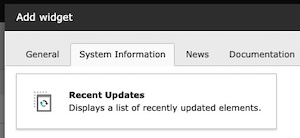

<div align="center">


# TYPO3 extension `xima_typo3_recent_updates`

[](https://extensions.typo3.org/extension/xima_typo3_recent_updates)
[](https://extensions.typo3.org/extension/xima_typo3_recent_updates)
[](https://packagist.org/packages/xima/xima-typo3-recent-updates)
[](https://github.com/xima-media/xima-typo3-recent-updates/actions/workflows/cgl.yml)
[](https://github.com/xima-media/xima-typo3-recent-updates/actions/workflows/tests.yml)
[](LICENSE.md)

</div>

This TYPO3 extension provides a dashboard widget to display recent updates which have been made in the TYPO3 backend. It helps editors and administrators to quickly see what has changed recently, enhancing transparency and collaboration within the team.

> [!NOTE]
> The information displayed in the widget is based on the "content" channel of the TYPO3 system log. Therefore, it only shows updates that have been logged in the system log.

## 🔥 Installation

### Requirements

* TYPO3 >= 11.5
* PHP 8.1+

### Composer

[](https://packagist.org/packages/xima/xima-typo3-recent-updates)
[](https://packagist.org/packages/xima/xima-typo3-recent-updates)


``` bash
composer require xima/xima-typo3-recent-updates
```

### TER

[](https://extensions.typo3.org/extension/xima_typo3_recent_updates)
[](https://extensions.typo3.org/extension/xima_typo3_recent_updates)

Download the zip file from [TYPO3 extension repository (TER)](https://extensions.typo3.org/extension/xima_typo3_recent_updates).

## 💡 Usage

1. Install the extension.
2. Add the "Recent Updates" widget to your dashboard via the "System Information" tab.

   
3. Display the recent updates within your dashboard.

   


## 🧑‍💻 Contributing

Please have a look at [`CONTRIBUTING.md`](CONTRIBUTING.md).

## 💎 Credits

The extension icon based on the original
[`module-install-upgrade`](https://typo3.github.io/TYPO3.Icons/icons/module/module-install-upgrade.html) icon from TYPO3 core which is
originally licensed under [MIT License](https://github.com/TYPO3/TYPO3.Icons/blob/main/LICENSE).

## ⭐ License

This project is licensed
under [GNU General Public License 2.0 (or later)](LICENSE.md).
