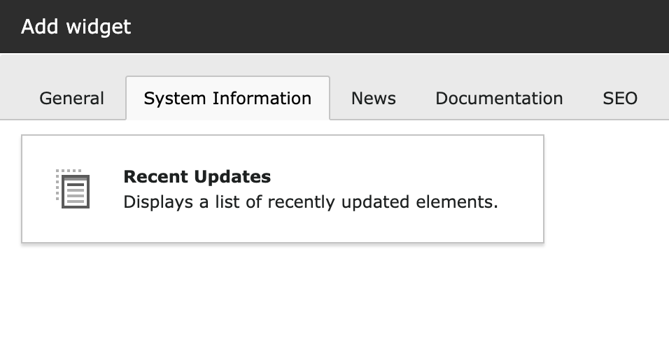
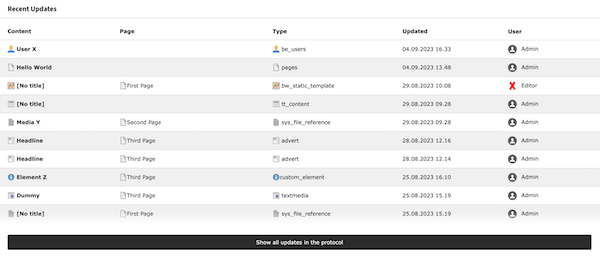

<div align="center">


# TYPO3 extension `xima_typo3_recent_updates_widget`

[]()

</div>

This TYPO3 extension provides a dashboard widget to display all recent updates of the CMS content.

# Installation

In a composer-based TYPO3 installation you can install the extension EXT:xima-typo3-recent-updates-widget via composer:

``` bash
composer require xima/xima-typo3-recent-updates-widget
```

# Usage

1. Install the extension.
2. Add the widget to your dashboard via the "System Information" tab.
   
3. Display the recent updates within your dashboard.
   
